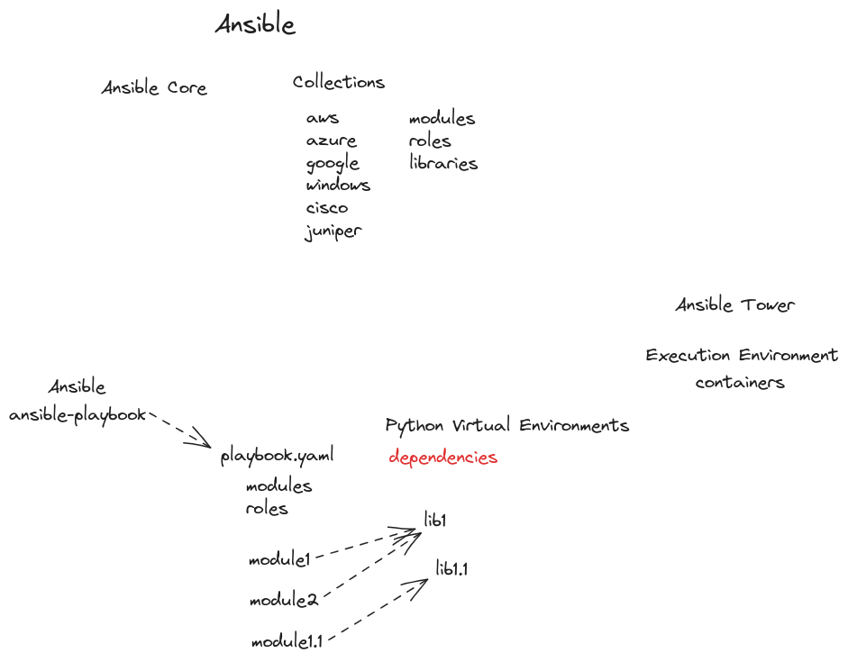

- [[ELA24-01/Day2]]
	- **Topic**
		- Installing Ansible
			- Community Ansible
				- Ansible Core
				- Ansible - Built-in Collections
			- Ansible Core in AlmaLinux
			- Red Hat Ansible Automation Platform 2.2 (RHCE)
				- Ansible Core
				- Ansible Collections (Automation Content Collections)
				- Ansible Navigator (Automation Content Navigator)
				- Ansible Execution Environment (Automation Execution Environment)
				- Ansible Tower (Automation Controller)
				- Ansible Galaxy (Automation Hub)
				- [[Notes/Red Hat AAP]]
		- Ansible Core
			- [Releases and maintenance - Ansible Community Documentation](https://docs.ansible.com/ansible/latest/reference_appendices/release_and_maintenance.html)
		- Environment Preparation
			- Control Node
			- Managed Hosts
				- Linux (AlmaLinux)
					- SSH
					- Python version Compatibility Check
				- Windows
					- PowerShell version 3
					- DotNet Framework
					- WinRM
				- Network Devices
					- SSH
					- API
			- Installation
			  id:: 672796cf-1069-47fa-943f-1a1167bac9a9
				- ```shell
				  python -m venv ansible
				  source ~/ansible/activate
				  pip install ansible-navigator==0
				  pip install ansible-navigator==2.1.0
				  ansible-navigator --version
				  ansible-navigator
				  sudo dnf install podman -y
				  ansible-navigator
				  deactivate
				  ```
	- **Homework**
		- Compare Ansible Navigator version in Red Hat AAP 2.2 with Community Ansible
	- ---
	- **Up next:**
		- Managing Ansible Inventory
			- Static Inventory
			- Dynamic Inventory
		- Managing Ansible Environment
			- ansible.cfg
			- ansible-navigator.yaml
	- **Whiteboard**
	  collapsed:: true
		- 
	- **Recording**
		- #+BEGIN_NOTE
		  Login with the authorized Google Account to access the video
		  #+END_NOTE
		- {{video https://www.youtube.com/watch?v=pcV5Dwzkxxw&list=PLJCT2DpK4voce0gPHQtevi5PGUJ_y-2nl&index=2}}