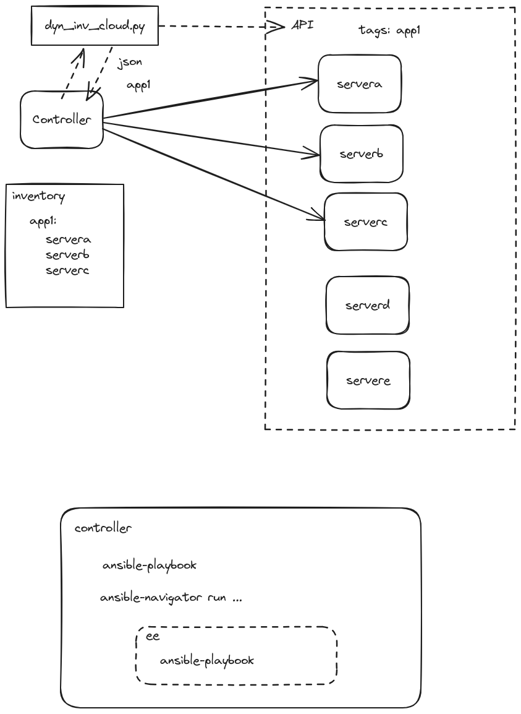

alias:: ELA24-01_Day-3

- [[ELA24-01/Day3]]
	- **Topic**
		- Managing Ansible Inventory
			- Static Inventory
				- Store in File and update manually
			- Dynamic Inventory
				- update automatically via APIs
			- [How to build your inventory - Ansible Community Documentation](https://docs.ansible.com/ansible/latest/inventory_guide/intro_inventory.html)
		- Ansible Navigator
			- ```shell
			  ansible-navigator inventory -i inventory -m stdout --list
			  ansible-navigator inventory -i inventory -m stdout --graph group01
			  ```
		- VIM Config for YAML `~/.vimrc`
			- ```shell
			  autocmd FileType yaml setlocal ai et ts=2 sw=2
			  ```
	- **Homework**
		-
	- **Up next**
		- Setting up SSH for Managed Hosts
		- Privilege Escalation (sudo)
	- **Whiteboard**
	  collapsed:: true
		- 
	- **Recording**
		- #+BEGIN_NOTE
		  Login with the authorized Google Account to access the video
		  #+END_NOTE
		- {{video https://www.youtube.com/watch?v=FJqVW5Wfbdw}}