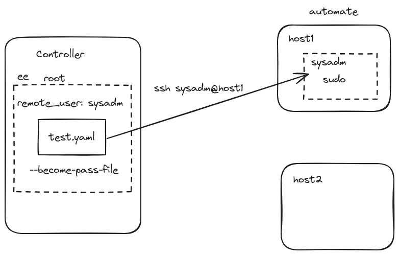

- [[ELA24-01/Day4]]
	- **Topic**
		- Setting up SSH for Managed Hosts
			- Controller Host
				- ```shell
				  ssh-keygen
				  ssh-copy-id user@host1.example.com
				  ```
		- Privilege Escalation (sudo)
			- Become Options in `ansible.cfg`
				- ```shell
				  [defaults]
				  remote_user = sysadm
				  inventory = inventory
				  
				  [privilege_escalation]
				  become = true
				  become_method = sudo
				  become_user = root
				  become_ask_pass = False
				  ```
			- Become Options in Playbook
				- ```yaml
				  ---
				  - name: play one
				    hosts: all
				    remote_user: sysadm
				    become: true
				    become_method: sudo
				    become_user: root
				  ```
			- Passwordless sudoer
				- Managed Host `/etc/sudoers.d/automate`
					- ```shell
					  automate ALL=(ALL) NOPASSWD: ALL
					  ```
		- Playbook
			- can contain multiple plays
			- ```yaml
			  ---
			  - name: play one
			    hosts: group1
			    tasks:
			    - name: play one - task one
			      debug:
			        msg: "Play One - Task One"
			    - name: play one - task two
			      debug:
			        msg: "Play One - Task Two"
			  
			  - name: play two
			    hosts: group2
			    tasks:
			    - name: play two - task one
			      debug:
			        msg: "Play Two - Task One"
			    - name: play two - task two
			      debug:
			        msg: "Play Two - Task Two"
			  ```
		- Environment Preparation (Playbook)
			- ```yaml
			  ---
			  - name: environment preparation
			    hosts: all
			    remote_user: sysadm
			    become: true
			    gather_facts: false
			    tasks:
			    - name: create automate user
			      ansible.builtin.user:
			        name: automate
			        uid: 5000
			        state: present
			        #remove: true
			        #state: absent
			  
			  #  - name: status
			  #    ansible.builtin.debug:
			  #      msg: automate user has been created
			  ```
	- **Homework**
		-
	- **Up next**
		- More about Privilege Escalation (become)
		- Continue to develop Environment Preparation Playbook
	- **Whiteboard**
		- 
	- **Recording**
		- #+BEGIN_NOTE
		  Login with the authorized Google Account to access the video
		  #+END_NOTE
		- {{video https://www.youtube.com/watch?v=FJqVW5Wfbdw}}