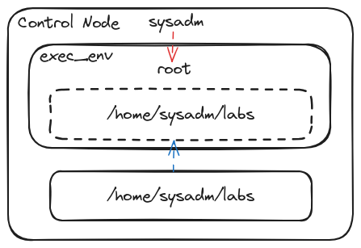

- [[ELA24-01/Day6]]
	- **Topic**
		- Finding Collections and Modules
			- ```shell
			  ansible-navigator collections
			  ```
				- Filter `ansible-navigator`
					- ```shell
					  :f <regular expression>
					  ```
			- Legacy
				- ```she``ll
				  ansible-doc -l
				  ```
		- File Management Modules
			- `ansible.builtin.file`
			- file_test.yaml
			- ```yaml
			  ---
			  - name: file module testing
			    hosts: localhost
			    connection: local
			    gather_facts: false
			    tasks:
			    - name: show message
			      ansible.builtin.debug:
			        msg: "Hello World!"
			  
			    - name: create file
			      ansible.builtin.file:
			        path: foo.txt
			        state: touch
			  
			    - name: create directory
			      ansible.builtin.file:
			        path: foo_dir
			        state: directory
			  
			    - name: create another file
			      ansible.builtin.file:
			        path: foo_dir/bar.txt
			        state: touch
			  
			  #  - name: list files
			  #    ansible.builtin.shell: pwd && ls -l && ls -ld /runner
			  ```
	- **Homework**
		- `ansible.builtin.copy`
		- Copy `/etc/ssh/sshd_config` file into `/tmp` on Managed Host 1
		- Create a `hello.txt` file under `/tmp` directory on Managed Host 2 with the message, *"Hello World"* which is owned and accessible by `sysadm` user only.
	- **Up next**
		- `ansible.builtin.lineinfile`
		- `ansible.builtin.blockinfile`
		- `ansible.posix.synchronize`
	- **Whiteboard**
		- 
	- **Recording**
		- #+BEGIN_NOTE
		  Login with the authorized Google Account to access the video
		  #+END_NOTE
		- {{video https://www.youtube.com/watch?v=KiApxnu_BN8}}