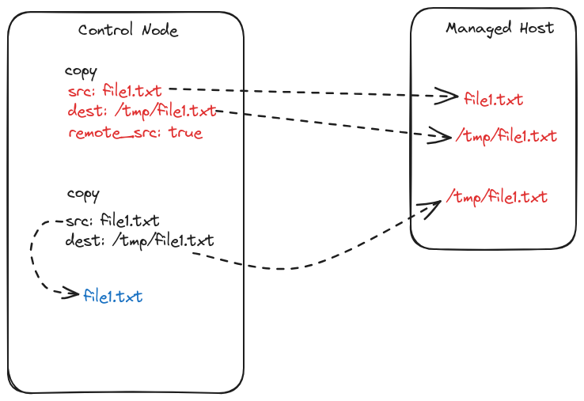

alias:: ELA24-01_Day-7

- [[ELA24-01/Day7]]
	- **Topic**
		- `ansible.builtin.lineinfile`
		- ```yaml
		  ---
		  - name: lineinfile module testing
		    hosts: ela24-01-host1.auto.lan
		    remote_user: automate
		    become: false
		    gather_facts: false
		    tasks:
		    - name: add a line to hello.txt
		      ansible.builtin.lineinfile:
		        path: /tmp/hello.txt
		        line: Welcome to ELA Class
		        create: true
		  
		    - name: add a line to hello.txt
		      ansible.builtin.lineinfile:
		        path: /tmp/hello.txt
		        search_string: 'Batch'
		        line: Year 2024 - Batch 2
		        create: true
		        firstmatch: true
		  ```
	- **Homework**
		- Explore `ansible.builtin.blockinfile`
	- **Up next**
		- `ansible.posix.synchronize`
	- **Tasks**
		- DONE Find a way to replace multiple lines
			- [ansible.builtin.replace module – Replace all instances of a particular string in a file using a back-referenced regular expression](https://docs.ansible.com/ansible/latest/collections/ansible/builtin/replace_module.html)
	- **Whiteboard**
		- 
	- **Recording**
		- #+BEGIN_NOTE
		  Login with the authorized Google Account to access the video
		  #+END_NOTE
		- {{video https://www.youtube.com/watch?v=uwdd6KKIudM}}