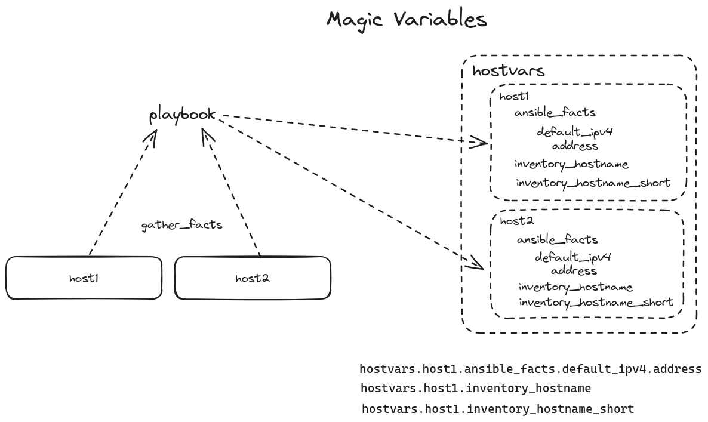

- [[ELA24-01/Day13]]
	- **Topic**
		- **Lab**: Magic Variable Use Case
			- ```yaml
			  ---
			  - name: generate hosts file
			    hosts: new_hosts
			  
			  - name: generate hosts file in local
			    hosts: localhost
			    connection: local
			    gather_facts: false
			    tasks:
			    - name: create hosts file
			      ansible.builtin.file:
			        path: newhosts
			        state: touch
			  
			    - name: add host1 info
			      ansible.builtin.lineinfile:
			        path: newhosts
			        line: "{{ hostvars['ela24-01-host1.auto.lan']['ansible_facts']['default_ipv4']['address'] }} {{ hostvars['ela24-01-host1.auto.lan']['inventory_hostname'] }} {{ hostvars['ela24-01-host1.auto.lan']['inventory_hostname_short'] }}"
			  
			    - name: add host2 info
			      ansible.builtin.lineinfile:
			        path: newhosts
			        line: "{{ hostvars['ela24-01-host2.auto.lan']['ansible_facts']['default_ipv4']['address'] }} {{ hostvars['ela24-01-host2.auto.lan']['inventory_hostname'] }} {{ hostvars['ela24-01-host2.auto.lan']['inventory_hostname_short'] }}"
			  ```
		- **Task Iteration with Loops**
			- [Loops - Ansible Community Documentation](https://docs.ansible.com/ansible/latest/playbook_guide/playbooks_loops.html)
			- ```yaml
			  ---
			  - name: loop test
			    hosts: localhost
			    connection: local
			    gather_facts: no
			    tasks:
			    - name: Pen-Pineapple Apple-Pen with with_nested
			      ansible.builtin.debug:
			        msg: "I have a {{ item.1 }}. I have {{ item.0 }}. {{ item.0 }}-{{ item.1 }}!"
			      with_nested:
			      - [apple, pineapple]
			      - [pen]
			  
			    - name: Pen-Pineapple Apple-Pen with Loop
			      ansible.builtin.debug:
			        msg: "{{ item }}"
			      loop: 
			      - pen
			      - pineapple
			      - apple
			      - pen
			  ```
	- **Homework**
		- Enhance [[ELA24-01/Day10]] Homework with loop
	- **Up next**
		- More about iteration
		- Conditional tasks
	- **Whiteboard**
	  collapsed:: true
		- 
	- **Recording**
		- #+BEGIN_NOTE
		  Login with the authorized Google Account to access the video
		  #+END_NOTE
		- {{video https://www.youtube.com/watch?v=4XCg37Qd224}}