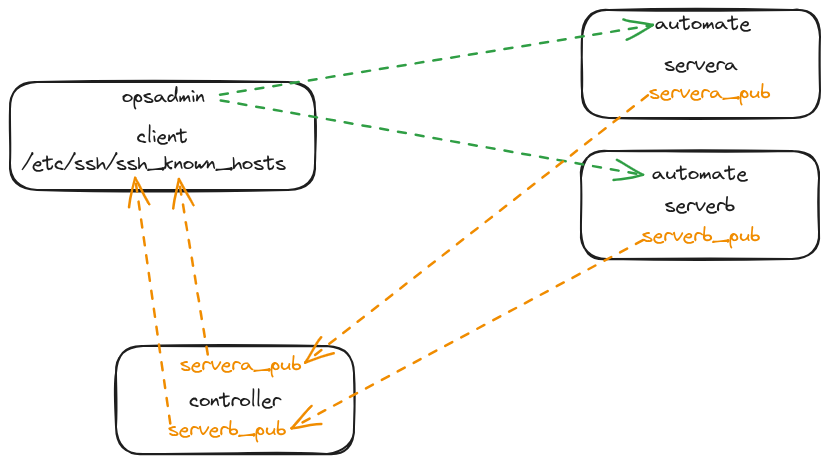

alias:: ELA24-01_Day-27

- [[ELA24-01/Day27]]
	- **Topic**
		- **Automating Linux Administration Tasks**
			- **User Management**
				- `ansible.builtin.user`
				- `ansible.builtin.group`
				- `ansible.builtin.slurp`
				- `ansible.builtin.known_hosts`
				- `ansible.posix.authorized_key`
				- `community.general.sudoers`
	- **Homework**
		- Create a user named `opsadmin` on a client
		- `opsadmin` need to be able to login to the managed hosts as the `automate` user without using password
		- `opsadmin` can use `tail` command as a sudoer
		- Copy Managed Hosts' public keys to a client for all users
	- **Up next**
		-
	- **Whiteboard**
		- 
	- **Recording**
		- {{video https://www.youtube.com/watch?v=HF9paYxaGrQ}}