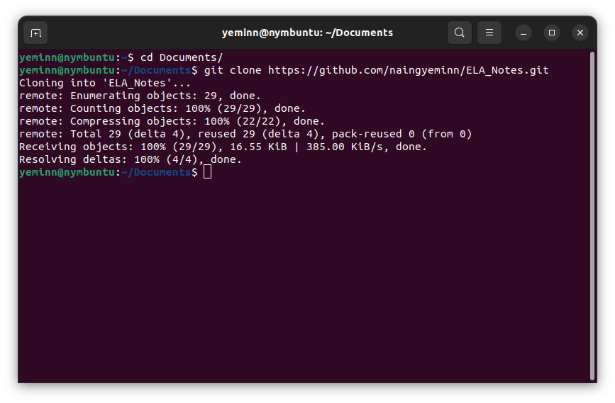
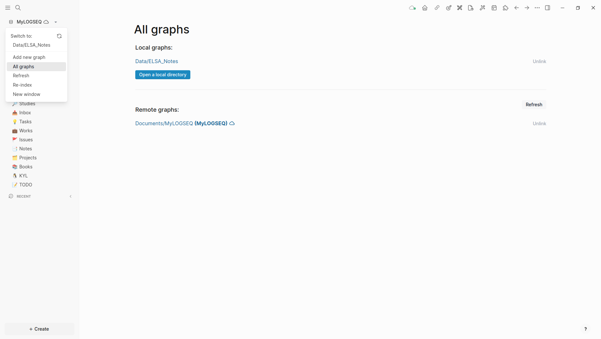
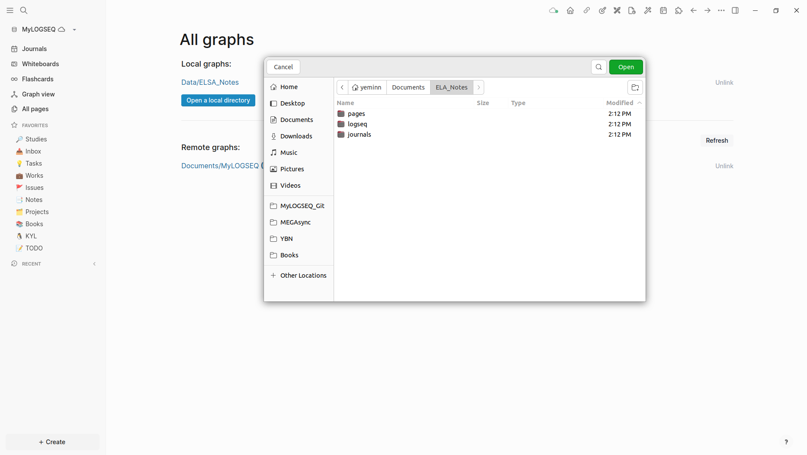
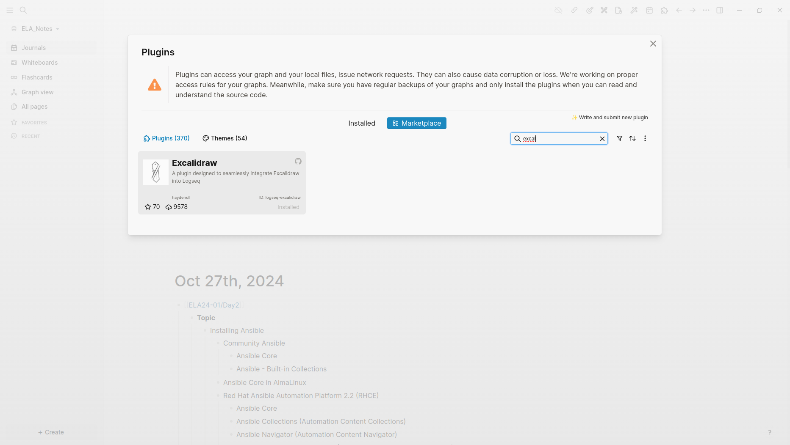

icon:: 📝

- # Notes for Enterprise Linux Automation Class
- ## Requirements
  
  This repository stores logseq graph data. It is recommended to use the Logseq Application to access the data.
  
  You can get it here. 
  [Logseq Download](https://logseq.com/downloads)
  
  You will require [logseq-plugin-excalidraw](https://github.com/haydenull/logseq-plugin-excalidraw) to be able see the whiteboards.
  This plugin can be installed through the Plugins manager of Logseq.
- ## How to Access
- **Clone the repo**
  ```shell
  git clone https://github.com/naingyeminn/ELA_Notes.git
  ```
  
  
- **Open it with Logseq**
	- Go to `All graphs`
	- Click on `Open a local directory`
	  
	  
- **Choose the git directory you cloned**
  
   
  > If you do not want to install the Logseq Application, you can view the notes via the [Logseq Demo](https://demo.logseq.com/) Page. However, you will not be able to view the whiteboards as they require the `Exclidraw` plugin.
- ## Plugin Installation
- Go to `Plugins` from the menu and look for the plugin called `Excalidraw` in the `Marketplace`
  
  
- ## Getting the updated Data
- **Pulling updated data from the repo**
  
  ```shell
  cd ELA_Notes
  git pull
  ```
  
   
  ---
- ## Want to know more about Logseq?
- [How to get started in Logseq](https://hub.logseq.com/getting-started/uQdEHALJo7RWnDLLLP7uux/how-to-get-started-in-logseq/pE1BPPvKGbWkSRXsprRnxM)
- [Logseq Intro Course](https://www.youtube.com/playlist?list=PLNnZ7rjaL84JjFpgDxRlAOKRa9ie25gtp)